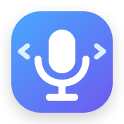

  

<h1 align="center">VoiceKey</h1>

  <strong>Голосове керування та диктування для Windows.</strong> 
  Одна апаратна кнопка — для нативних голосових дій. Інша — для універсального speech-to-text.

  <strong>🇺🇦 Українська</strong> · <a href="README.md">🇬🇧 English</a>

  
  
  
  

---

## Завантаження

Завантажуйте **актуальний VoiceKey** зі сторінки Releases.

**Рекомендовано:** \`VoiceKey_Setup_*.exe\`  
Файл перевірки: \`SHA256SUMS.txt\`.

➡️ **[Відкрити VoiceKey Releases](https://github.com/dkua0/VoiceKey-Releases/releases)**

## Що робить VoiceKey

VoiceKey — легка утиліта для Windows, яка прив'язує клавішу або кнопку HID-пульта до голосових функцій підтримуваних програм і сайтів.

- 🎤 **Native Voice** — запуск/зупинка нативної голосової функції або запису в активній програмі.
- ✍️ **Диктування** — перетворення мовлення на текст через Deepgram з автоматичною вставкою у вибране поле.
- 🎮 **Підтримка G10S** — кнопка Mic може працювати як START/STOP toggle.
- 🌐 **Окремі маршрути для сайтів і браузерів** — виправлення одного маршруту не повинно ламати інші.
- 🔒 **Приватність** — ключі захищаються Windows DPAPI, а діагностика не містить розпізнаного тексту чи аудіо.

## Підтримувані цілі

У поточній Working Beta є окремі маршрути для таких цілей, як:

**Telegram Desktop · WhatsApp Desktop/Web · ChatGPT · Gemini · Google Search · Google Перекладач · YouTube · Viber · Antigravity**

Сумісність може відрізнятися залежно від браузера та версії інтерфейсу. Перевірені маршрути ізолюються, щоб зміни для однієї цілі не створювали регресій в інших.

## Оновлення

VoiceKey перевіряє оновлення саме в цьому **публічному репозиторії релізів**.  
Вихідний код програми зберігається окремо в приватному репозиторії.

## Working Beta

Це активна beta-версія. Зміни інтерфейсу сайтів або програм можуть вимагати оновлення VoiceKey. Вбудовані маршрути постачаються всередині програми, а не у відкритому публічному каталозі.

---

  <strong>VoiceKey</strong> · голосове керування Windows без зміни звичного робочого процесу

